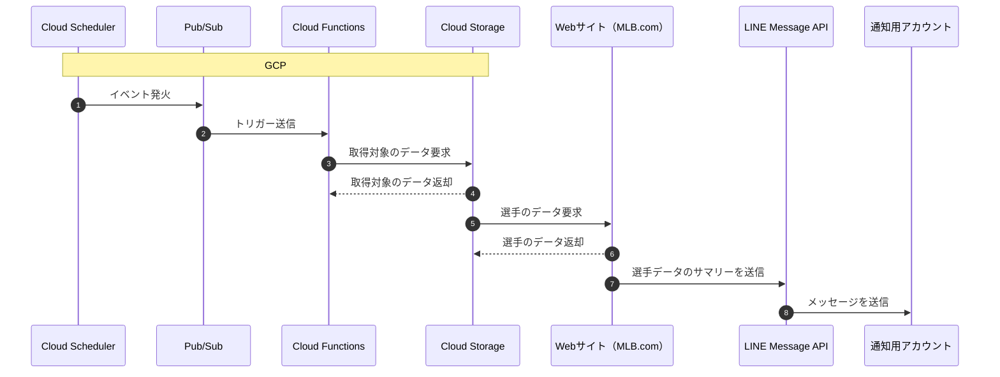

# mlb-players-stats

## 使用言語・構成
- アプリケーションコード: Go言語
- デプロイツール: Shell Script
- インフラ: GCP
  - イベント発火: Cloud Scheduler
  - トリガー: Pub/Sub
  - アプリ実行: Cloud Functions
  - ストレージ: Cloud Storage
     - アプリケーションコード（.zip）
     - 取得対象リスト（.json）
- LINE通知: LINE Message API


## シーケンス


## コードデプロイ手順
1. プロジェクトのルートディレクトリに移動する
2. デプロイ用のシェルスクリプトを実行する
    ```
    sh deploy.sh
    ```

## ローカルテスト
1. ./cmdディレクトリに移動する
2. Goのmainファイルを実行する
    ```
    go run main.go
    ```


## スクレイピング利用について
- 利用規約によると、個人的な利用は問題ないと記載されている
  - 参考: https://www.mlb.com/official-information/terms-of-use
- robots.txtファイルにおいても、情報を取得するURLへのスクレイピング・クローリングは禁止されていない
    ```robots.txt
    User-agent: *
    Disallow: /web/
    Disallow: /app/
    Disallow: /api/
    Disallow: /en/
    Disallow: /tv/
    Disallow: /mlb/
    Disallow: /share/
    Disallow: /embed/
    Disallow: /tokens/
    Disallow: /legacy
    Disallow: /beta
    Disallow: /es/legacy
    Disallow: /es/beta
    Sitemap: https://www.mlb.com/sitemaps/48-hr-news.xml.gz
    Sitemap: https://www.mlb.com/sitemaps/weekly-news/index.xml.gz
    Sitemap: https://www.mlb.com/sitemaps/weekly-video/index.xml.gz

    ＊4/18時点
    ```
   - 参考: https://www.mlb.com/robots.txt
